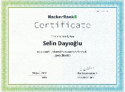
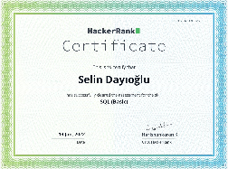
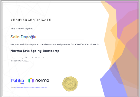
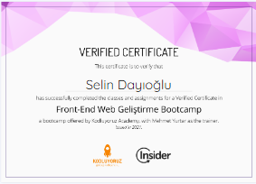
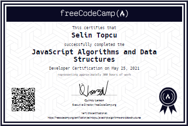
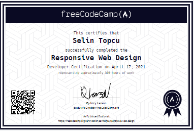
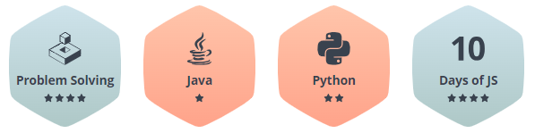

<h2 align="center">Hi 👋! I'm Selin, Java Full Stack Developer from Türkiye.</h2>

###

  
### Profile Views
  
  
### Languages
  
  
  
  
  
  
  
  
  
  
  
  
  
  
  

### Certificates
  
  
  
  
  
  

### Badges
  

      
### LeetCode
  
  
### Links
  
  
  
  
  
  
###
  
    

